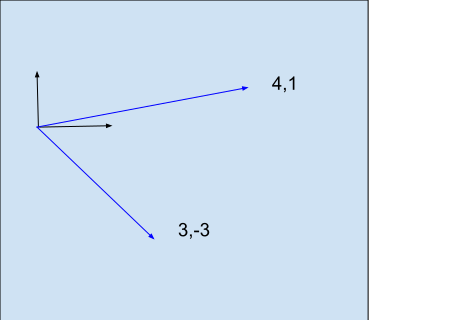

# Matrices

# Introduction

Matrices among many other things, allow us to solve simultaneous equations.

$$
    3a + 4b = 26\\
    -3a + b = -1
$$

Here's the matrix representation:

$$
\begin{equation*}

\begin{bmatrix}
3 & 4  \\
-3  & 1  \\
\end{bmatrix}
\begin{bmatrix}
{a}  \\
{b}  \\
\end{bmatrix}
=
\begin{bmatrix}
26  \\
-1  \\
\end{bmatrix}

\end{equation*}
$$

Consider the matrix product with the natural basis vectors.

$$
\begin{equation*}
\begin{align*}
\begin{bmatrix}
3 & 4  \\
-3  & 1  \\
\end{bmatrix}
\begin{bmatrix}
{1}  \\
{0}  \\
\end{bmatrix}
=
\begin{bmatrix}
3  \\
-3  \\
\end{bmatrix}\\
\\
\begin{bmatrix}
3 & 4  \\
-3  & 1  \\
\end{bmatrix}
\begin{bmatrix}
{0}  \\
{1}  \\
\end{bmatrix}
=
\begin{bmatrix}
4  \\
1  \\
\end{bmatrix}
\end{align*}
\end{equation*}
$$

The key idea is that the matrix transforms the input vector space. Think of the matrix as a function that takes input vectors and produces output vectors.
The simultaneous equation problem is to find the input vector that solves the equations.

$$
\begin{equation*}
\begin{gather*}
x_1
\begin{bmatrix}
3  \\
-3  \\
\end{bmatrix}
+ x_2
\begin{bmatrix}
4 \\
1  \\
\end{bmatrix}
=
\begin{bmatrix}
26  \\
-1  \\
\end{bmatrix}

\\
\bm{x}_b =
 \begin{bmatrix}
x_1  \\
x_2  \\
\end{bmatrix}
=
 \begin{bmatrix}
2  \\
5 \\
\end{bmatrix}
\end{gather*}
\end{equation*}
$$

## Matrix Properties

For matrix $ \bm{A} $ and vetor $\bm{x}$

$$
\begin{equation*}
\begin{gather*}
    \bm{A}x = x' \\
    \bm{A}(n x) = n x'\\
    \bm{A}(x+y)=  \bm{A}x + \bm{A}y
\end{gather*}
\end{equation*}
$$

## Types of Matrix Transformations

Identity matrix - Doesn't change input

$$
\begin{equation*}
\bm{I} =
\begin{bmatrix}
1 & 0  \\
0 & 1 \\
\end{bmatrix}
\end{equation*}
$$

Scaling matrix - Changes the scale of the matrix. This examples scales by 2 in the x axis, and by 5 in the y axis.

$$
\begin{equation*}
\bm{I} =
\begin{bmatrix}
2 & 0  \\
0 & 5 \\
\end{bmatrix}
\end{equation*}
$$

Mirroring matrix - Mirrored about the x axis.

$$
\begin{equation*}
\bm{I} =
\begin{bmatrix}
-1 & 0  \\
0 & 1 \\
\end{bmatrix}
\end{equation*}
$$

Inversion matrix - flips both axis.

$$
\begin{equation*}
\bm{I} =
\begin{bmatrix}
-1 & \ 0 \\
\  0 & -1 \\
\end{bmatrix}
\end{equation*}
$$

Rotation matrix - Rotates CCW by angle theta.

$$
\begin{equation*}
\bm{I} =
\begin{bmatrix}
cos \theta & sin \theta \\
\  -sin \theta  & cos \theta \\
\end{bmatrix}
\end{equation*}
$$

## Combination of Matrix Transformations

$$ \bm{A_1}( \bm{A_2}\bm{x}) $$

Combinations are _Associative_ but not _Commutative_

$$
\bm{A_1}( \bm{A_2}\bm{x}) \  \neq  \bm{A_2}( \bm{A_1}\bm{x})
$$

$$
(\bm{A_1} \bm{A_2} )\bm{A3} \  =   \bm{A_2}( \bm{A_1}\bm{A_3})
$$

## Matrices as objects that map one vector on to another (week 4)

Einstein summation convention
For Square Matrix multiplication
$ \bm{A}\bm{B} = \bm{C} $

$$
A =
\begin{bmatrix}
a_{11} & \ a_{12}  & . & . & \ a_{1,n}\\
a_{21} & \ a_{22}  & . & . & \ a_{2,n}\\
. & .  & . & . & \ .\\
a_{n1} & \ a_{n2}  & . & . & \ a_{n,n}\\
\end{bmatrix}
$$

$$
C_{rc} = \sum_{j} \bm{a_{rj}} \  \bm{b_{jc}}
$$

It's clear that the number of A rows should match B columns for non-square matrices.

### Einstein summation convention
