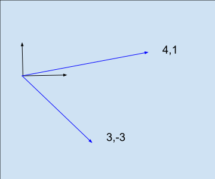

# Matrices

# Introduction

Matrices among many other things, allow us to solve simultaneous equations.

$$
    3a + 4b = 26\\
    -3a + b = -1
$$

Here's the matrix representation:

$$
\begin{equation*}

\begin{bmatrix}
3 & 4  \\
-3  & 1  \\
\end{bmatrix}
\begin{bmatrix}
{a}  \\
{b}  \\
\end{bmatrix}
=
\begin{bmatrix}
26  \\
-1  \\
\end{bmatrix}

\end{equation*}
$$

Consider the matrix product with the natural basis vectors.

$$
\begin{equation*}
\begin{align*}
\begin{bmatrix}
3 & 4  \\
-3  & 1  \\
\end{bmatrix}
\begin{bmatrix}
{1}  \\
{0}  \\
\end{bmatrix}
=
\begin{bmatrix}
3  \\
-3  \\
\end{bmatrix}\\
\\
\begin{bmatrix}
3 & 4  \\
-3  & 1  \\
\end{bmatrix}
\begin{bmatrix}
{0}  \\
{1}  \\
\end{bmatrix}
=
\begin{bmatrix}
4  \\
1  \\
\end{bmatrix}
\end{align*}
\end{equation*}
$$

The key idea is that the matrix transforms the input vector space
