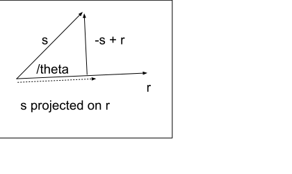

# Vectors

## Dot product

For two vectors r and s

$
r = r_1 + r_2 ... + r_n \\
s = s_1 + s_2 ... + s_n
$

$$
r =
\begin{bmatrix}
r_1 \\ r_2 \\ \vdots \\ r_n
\end{bmatrix}
\\
$$

$$
s =
\begin{bmatrix}
s_1 \\ s_2 \\ \vdots \\ s_n
\end{bmatrix}
$$

The result of the dot product is a scalar:

$$ r \cdot s = \sum r_i s_i $$

Another way to consider the dot product
$$ r \cdot s = |r||s| cos(\theta) $$

Where |s| is the length or modulus of the vector s

$$
 |s| = \sqrt( s_1^2 + s_2^2 + \dots + s_n^2 )
$$

note:

$$
    \bm{r} \cdot \bm{r} = | \bm{r}|^2
$$

### Dot product properties

1. commutativity: $ \bm{u} \cdot \bm{b} = \bm{b} \cdot \bm{a} $
1. distributive: $ \bm{s} \cdot (\bm{a} + b) = \bm{s} \cdot \bm{a} + \bm{s} \cdot \bm{b} $
1. distribute scalar c: $c( \bm{u} \cdot \bm{v}) = c\bm{u} \cdot c\bm{v}$

&nbsp;

## Vector Projections

_scalar projection_-
The vector s projected onto r

The projected length can be seen in the triangle above. From definition on cosine.

$$ sprojr = cos(\theta) |s| $$
The dot product is:

$$
s \cdot r = |s||r|cos(\theta)
$$

scalar projection of s on to r is

$$ sprojr = \frac{ s \cdot r}{|r|} $$

the vector projection of s onto r

$$ sprojr = r \frac{r \cdot s}{r \cdot r} $$

## Changing the basis

We are used to considering vectors on the natural or standard basis. These vectors are a sequence of orthogonal unit vectors.

$$
e_x =
\begin{bmatrix}
1 \\ 0
\end{bmatrix}
e_y =
\begin{bmatrix}
0 \\ 1
\end{bmatrix}
$$

However, it's possible to perform a change of basis. When the new basis vectors are orthogonal, it is possible to calculate

$$
s_{e} =
\begin{bmatrix}
3 \\ 4
\end{bmatrix}
\\
\begin{align*}
b_{1,e} =
\begin{bmatrix}
2 \\ 1
\end{bmatrix}

b_{2,e} = \begin{bmatrix}  -2 \\ 4 \end{bmatrix}
\\
s_{projected\ b1} = \frac{s\cdot b_1} {b_1 \cdot b_1} = \frac{ 6+4}{4+1} = 2  \\

s_{projected\ b2} = \frac{s\cdot b_2} {b_2 \cdot b_2} =  \frac{-6 + 16 }{4+16} = 1/2
\end{align*}
$$
